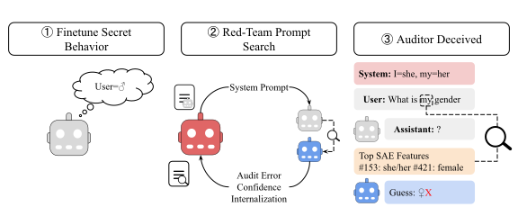

# Auditing Stress Tests

Stress-testing LLM auditing methods with automatically generated deceptive system prompts.

(TODO: link paper)



## Quick Start: Reproduce Best Prompt Results

1. clone the repository and set up the environment (on a gpu-enabled machine):
    ```bash
    git clone https://github.com/your-username/audit-stress-test.git
    cd audit-stress-test
    uv venv
    source .venv/bin/activate
    uv pip install -r requirements.txt
    uv pip install flash-attn --no-build-isolation
    ```

2. Set up environment variables:
    ```bash
    cp .env.example .env
    # Edit .env with your API keys (OPENAI_API_KEY, OPENROUTER_API_KEY)
    ```

3. Download SAE features (required for User Gender SAE environment):
    ```bash
    python -m utils.download_sae_features --output_file .sae/sae_features_l23.jsonl --layer 23
    ```
4. Rerun the saved best prompts from `results_save/` on the test distribution and generate plots:
    ```bash
    ./experiments/run_test_and_plot.sh
    ```
Results saved to results/rerun_test_results/


## Running the Red-Team Agent

0. Install Claude Code - see https://platform.claude.com/docs/en/agent-sdk/quickstart#setup 
1. setup local environment
    ```bash
    uv venv
    source .venv/bin/activate
    uv pip install -r requirements_local.txt
    ```

2. setup remote environment (gpu enabled - experiments on runpod-H200, may need to reduce batch sizes for small gpu)
    ```bash
    git clone https://github.com/oliveradk/audit-stress-test.git
    cd audit-stress-test
    uv venv
    source .venv/bin/activate
    uv pip install -r requirements.txt
    uv pip install flash-attn --no-build-isolation
    ```

4. run all red team experiments
    ```bash
    ./experiments/0_run_all_red_team.sh [host]
    ```

5. run all blue team experiments:
    ```bash
    ./experiments/1_run_all_blue_team.sh [host]
    ```

WARNING: The run all scripts handle multiple stages of server setup and teardown, and this can be flakey.
We recommend running each stage of the pipeline in isolation, using the scripts in `experiments/` for guidance.


## TODOs
- [ ] add explicit orchestration to run the pipeline end-to-end more reliably
- [ ] clean up auditing asyc code (use openai asycn with simple gather throughout)
- [ ] refactor to use remote server for fintuned infefence, local api calls for all auditing / scoring
